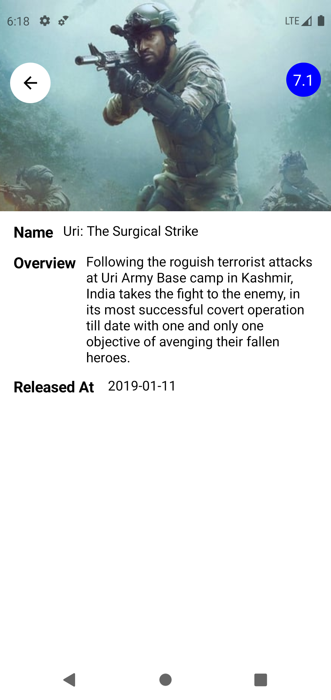

# Dru_task
Create an application and connect it with the mentioned API.

## ScreenShots:

  
  
  
  

## Demo (GIF)

  

## APK Download
[Click here](https://drive.google.com/file/d/1dhTtxG9t49mCsQ6jsAVy0PTwVUZf92n0/view?usp=sharing)

## In-App architecture

  

## Note
The cached data deleted    
- In debug after 15 MIN (for testing purposes)
- In release after 4 HOURS 

## Features
- Caching
- Obfuscation
- Simple UI
- Config changes handling

## Tools & APIs
- Jetpack Compose
- Compose navigation
- Clean architecture
- MVVM arch pattern (reactive MVI)
- Coroutines & flows
- Retrofit
- Work-manager
- Room
- Coil
- Proguard

